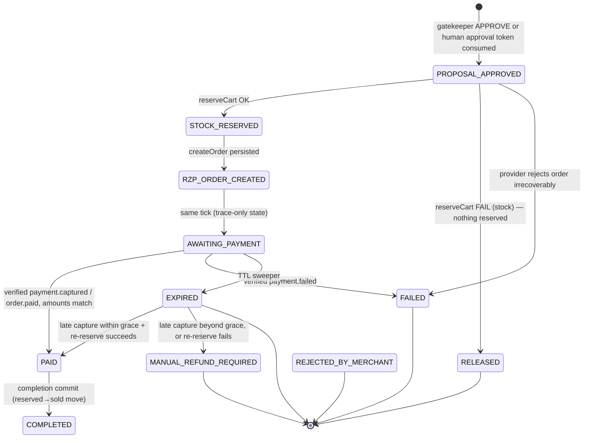

# GrowthAgent — Settlement Subsystem Design
### settlement-agent · Razorpay integration · idempotency · stock reservations

Scope: components 7 (settlement-agent) of seven, plus the stock-reservation store, the three-layer idempotency machinery, the webhook ingress, crash-reconciliation sweeps, and the escalation re-entry handoff. Everything here is Node.js + TypeScript, Postgres, Redis. All money is **integer paise**, end to end. The settlement agent is **deliberately dumb**: zero LLM calls, zero pricing math, zero discount logic. It executes exactly what the gatekeeper approved and nothing else.

---

## 0. Verified-facts ledger

Facts below were confirmed against official Razorpay documentation on 2026-08-25 via direct fetches. Anything not confirmable is flagged ⚠️ and repeated in §17.

| # | Fact | Status | Source |
|---|------|--------|--------|
| V1 | `POST /v1/orders` takes `amount` as integer **in the smallest currency sub-unit** (paise for INR; e.g. ₹299 → `29900`) | ✅ verified | https://razorpay.com/docs/api/orders/create/ |
| V2 | `currency` is a 3-char ISO code; `INR` supported | ✅ verified | same |
| V3 | `receipt` is optional, **max 40 chars, must be unique**; docs errors section states *"receipt is treated as an idempotency key"* — duplicate receipts rejected with 400 | ✅ verified | same |
| V4 | `notes` is a JSON object, **max 15 key–value pairs, 256 characters max each** | ✅ verified | same |
| V5 | Order response shape: `{ id: "order_…", entity:"order", amount, amount_due, amount_paid, attempts, created_at(unix s), currency, notes, offer_id, receipt, status }`; `status ∈ {created, attempted, paid}` | ✅ verified | same |
| V6 | Docs error text: order amount subunits "should always be greater than 100" (min ≈ ₹1) | ✅ verified (exact boundary semantics ⚠️) | same |
| V7 | Webhook signature arrives in header **`X-Razorpay-Signature`**; algorithm is **HMAC-SHA256 with the webhook secret as key and the raw request body as message**; docs warn "Do Not Parse or Cast the Webhook Request Body" before hashing; after a secret rotation, old payloads validate only against the old secret | ✅ verified | https://razorpay.com/docs/webhooks/validate-test/ |
| V8 | Duplicate deliveries are normal ("your endpoint might receive the same webhook event multiple times"); dedupe using the **`x-razorpay-event-id`** request header, whose value is unique per event | ✅ verified | validate-test page + best-practices page |
| V9 | Delivery is **at-least-once**; every non-2xx response counts as delivery failure → exponential-backoff retries **for 24 hours** after event-creation timestamp; persistent failure auto-disables the webhook; **server must respond 2xx within 5 seconds** or the delivery is treated as unprocessed and resent; no strict ordering guarantee; ports 80/443 only; TLS 1.2+ | ✅ verified | https://razorpay.com/docs/webhooks/best-practices/ |
| V10 | Envelope shape: top-level `{ entity:"event", account_id, event, contains:[…], payload, created_at }`; `payment.captured` carries `payload.payment.entity` (`id:"pay_…"`, `amount`, `currency`, `status:"captured"`, `captured:true`, `order_id`, `method`, `fee`, `tax`, `error_*:null`, …); `payment.failed` adds the `error_code/error_description/error_source/error_step/error_reason` block | ✅ verified | https://razorpay.com/docs/webhooks/payloads/payments/ |
| V11 | `order.paid` fires together with `payment.captured` on capture; envelope `contains:["payment","order"]` with **both** `payload.payment.entity` and `payload.order.entity` (`status:"paid"`, `attempts`, `receipt`, `amount_paid`, …) | ✅ verified | https://razorpay.com/docs/webhooks/payloads/orders/ |
| V12 | Caveats: `payment.failed` is *not* triggered if the payment fails during authorisation of the first attempt; a `payment.failed` followed later by `payment.captured` for the same transaction is expected behaviour (late authorisation / UPI TPAP retries); don't hardcode `vpa` | ✅ verified | payloads page |
| U1 | Whether `GET /v1/orders` supports filtering by `receipt` (for adopting an orphaned order during reconciliation) | ⚠️ unverified | index page lists endpoints but parameter list not inspected |
| U2 | The exact Razorpay machine error `code` returned for a duplicate receipt (we know it is a 400 and that receipt acts as an idempotency key, but not the canonical code string) | ⚠️ unverified | inferred from create-page errors section |
| U3 | Exact minimum-amount boundary (`> 100` vs `>= 100` paise) | ⚠️ unverified | see V6 |
| U4 | Whether `x-razorpay-event-id` is covered by the signature | ⚠️ inference: **not** — V7 states only the body is the signed message; therefore the header is treated as advisory (§8.3) | derived from V7 |

---

## 1. Role and trust position

```
gatekeeper APPROVE ─┐
                    ├─► settle(proposal) ─► [reserve stock] ─► [create order] ─► AWAITING_PAYMENT
human approves      ─┘        (same frozen proposal bytes, never re-proposed)
                                   ▲                                  │
                                   │        signed webhook (real or mock-simulated, SAME code path)
                                   │                                  ▼
                            [completion commit] ◄─────────────── PAID ──► COMPLETED
```

Non-negotiables inherited from the system philosophy, restated for this subsystem:

1. **Only settlement talks to Razorpay.** No other module imports the SDK or the adapter.
2. **Settlement trusts no agent.** Its input is a `SettleableProposal` that embeds the gatekeeper's APPROVE verdict (or a single-use human approval token for escalations). Settlement re-checks mechanical facts cheaply (amount equals the approved total stored on the tx row; proposal digest unchanged; stock still reservable) — not because it doubts the gatekeeper, but because disk state may have drifted between approve and execute.
3. **No AI anywhere in this path.** Every decision is SQL, Redis, or pure TS. Determinism is the feature.
4. **Every observable step appends to the hash-chained audit log** and emits an SSE event the frontend trace screen renders live.
5. **Money is `number` holding integer paise** (JS doubles represent integers exactly up to 2^53; our max cart ≈ ₹99,999 → 9,999,900 paise, four orders of magnitude below the limit). Zod enforces `.int()` at every boundary; there is no float money anywhere.

---

## 2. Module layout

```
api/src/settlement/
  provider/
    types.ts               # SettlementProvider, DTOs, typed error classes
    sign.ts                # hmacSha256Hex(), secureCompareHex()
    payload.schema.ts      # zod schemas for webhook envelopes (parsed AFTER auth)
    webhook.builder.ts     # canonical payload builder shared by MockProvider + test fixtures
    razorpay.provider.ts   # real TEST-mode Orders API + webhook verification
    mock.provider.ts       # faithful local double; signs + POSTs loopback webhooks
  idempotency/
    middleware.ts          # layer-1 inbound gate
    redis-store.ts         # SET NX PX + Lua finalize
    pg-store.ts            # unique-constraint fallback + response snapshot
  reserve.ts               # atomic multi-line stock reservation + release + commit moves
  state-machine.ts         # transition table, CAS helpers, illegal-transition guard
  settle.ts                # entry point: SettleableProposal → AWAITING_PAYMENT
  webhook-handler.ts       # raw-body route + verification + dedupe + dispatch
  completion.ts            # PAID → COMPLETED (idempotent commit)
  sweeper.ts               # TTL release + reconciliation sweeps (Clock-injected)
  clock.ts                 # Clock interface; SystemClock | VirtualClock (DEMO_STABLE_MODE)
  routes.ts                # POST /v1/tx/settle, POST /webhooks/razorpay, GET /v1/tx/:id
  migrations/V7__settlement.sql
shared/src/settlement.ts   # SettleableProposal + DTO zod schemas (single source of truth)
```

---

## 3. Shared domain types (verbatim)

```ts
// shared/src/settlement.ts
import { z } from 'zod';

/** Integer paise. Never floats. Never rupee conversion outside presentation. */
export const Paise = z.number().int().nonnegative();
export type Paise = z.infer<typeof Paise>;

export const Ulid = z.string().regex(/^[0-9A-HJKMNP-TV-Z]{26}$/);
export type Ulid = z.infer<typeof Ulid>;

export const TxId = z.string().startsWith('tx_');           // "tx_" + 26-char ULID
export type TxId = z.infer<typeof TxId>;

export const Currency = z.literal('INR');

export const SettlementLine = z.object({
  sku: z.string().min(1).max(64),
  qty: z.number().int().positive().max(99),
  unit_price_paise: Paise,          // RAW merchant list price minus approved line discount,
                                    // already computed & gatekeeper-checked upstream
}).strict();
export type SettlementLine = z.infer<typeof SettlementLine>;

/** What settlement accepts. Produced ONLY by the gatekeeper (AUTO) or the approvals inbox (HUMAN). */
export const SettleableProposal = z.object({
  tx_id: TxId,
  proposal_id: z.string().min(1),                  // negotiation output id (frozen)
  proposal_sha256: z.string().length(64),          // digest of the frozen proposal bytes
  lines: z.array(SettlementLine).min(1).max(20),
  total_amount_paise: Paise,
  currency: Currency,
  gatekeeper: z.object({
    verdict: z.literal('APPROVE'),
    ruleset_version: z.number().int().positive(),
    trace_digest: z.string().length(64),           // sha256 of the full rule-trace JSON
  }).strict(),
  approval_source: z.enum(['GATEKEEPER_AUTO', 'HUMAN_ESCALATION']),
  approval_token: z.string().min(32).optional(),   // REQUIRED iff HUMAN_ESCALATION; single-use
}).strict()
  .refine(p => p.approval_source === 'HUMAN_ESCALATION' ? p.approval_token !== undefined : true,
          { message: 'approval_token required for escalated proposals' });
export type SettleableProposal = z.infer<typeof SettleableProposal>;

export const SettleRequest = z.object({
  idempotency_key: z.string().uuid(),              // REQUIRED (layer 1)
  proposal: SettleableProposal,
}).strict();

export type TxState =
  | 'PROPOSAL_APPROVED' | 'STOCK_RESERVED' | 'ORDER_CREATING' | 'RZP_ORDER_CREATED' | 'AWAITING_PAYMENT'
  | 'PAID' | 'COMPLETED'                                // happy path
  | 'FAILED' | 'EXPIRED' | 'RELEASED'                   // negative paths
  | 'REJECTED_BY_MERCHANT'                              // escalation declined (terminal)
  | 'MANUAL_REFUND_REQUIRED';                           // late capture we cannot fulfil (terminal)
```

---

## 4. SettlementProvider contract (verbatim)

```ts
// api/src/settlement/provider/types.ts
export type ProviderKind = 'razorpay' | 'mock';

export interface SettlementOrderRequest {
  tx_id: TxId;
  /** Deterministic fn(tx_id): `ga_${ulid}` → 29 chars ≤ 40-char limit (V3). Globally unique. */
  receipt: string;
  amount_paise: Paise;
  currency: 'INR';
  /** ≤15 pairs, each value ≤256 chars (V4). Values are IDs/hashes only — never prices. */
  notes: Record<string, string>;
}

export interface SettlementOrderHandle {
  provider: ProviderKind;
  rzp_order_id: string;              // real: "order_" prefix (V5); mock: "order_mock_…"
  receipt: string;
  amount_paise: Paise;
  currency: 'INR';
  provider_status: 'created';
  created_at_epoch_sec?: number;
}

/** Discriminated union produced ONLY after signature authentication succeeds. */
export type ParsedWebhook =
  | { kind: 'payment.captured'; event_id: string; occurred_at_epoch_sec: number;
      payment: PaymentEntity }
  | { kind: 'order.paid';       event_id: string; occurred_at_epoch_sec: number;
      payment: PaymentEntity; order: OrderEntity }                       // V11: both entities
  | { kind: 'payment.failed';   event_id: string; occurred_at_epoch_sec: number;
      payment: PaymentEntity }                                           // carries error block
  | { kind: 'ignored';          event_id: string; event: string };     // unknown event: ACK, ignore

export interface PaymentEntity {
  id: string;                        // "pay_…"
  amount: number;                    // paise
  currency: string;
  status: string;                    // "captured" | "failed" | "authorized"
  order_id: string;                  // "order_…"
  method: string | null;
  captured: boolean;
  fee: number | null; tax: number | null;
  error_code: string | null; error_description: string | null;
  created_at: number;
}
export interface OrderEntity {
  id: string; amount: number; amount_paid: number; amount_due: number;
  currency: string; receipt: string; status: string; attempts: number;
}

export class SettlementError extends Error {}
export class ProviderUnavailableError extends SettlementError {}   // timeouts / 5xx → retryable
export class ProviderRejectedError extends SettlementError {
  constructor(public providerCode: string, public providerDescription: string,
              public httpStatus: number) { super(`${providerCode}: ${providerDescription}`); }
}
export class DuplicateReceiptError extends ProviderRejectedError {  // 400 w/ receipt complaint (U2)
  constructor(d: string) { super('DUPLICATE_RECEIPT', d, 400); }
}
export class WebhookAuthenticationError extends SettlementError {}  // bad/missing signature

/**
 * THE seam. Narrow and dumb on purpose: two methods, no query/refund/capture verbs.
 * Whatever cannot be expressed through these two methods is out of scope for settlement by design.
 */
export interface SettlementProvider {
  readonly kind: ProviderKind;
  createOrder(req: SettlementOrderRequest): Promise<SettlementOrderHandle>;
  /**
   * Synchronous. Pure. Throws WebhookAuthenticationError on missing/invalid signature.
   * MUST receive the raw, unparsed body bytes (V7). Parsing happens only after authentication.
   */
  verifyAndParseWebhook(rawBody: Buffer, signatureHeader: string | null,
                        eventIdHeader: string | null): ParsedWebhook;
}
```

Signature primitives:

```ts
// api/src/settlement/provider/sign.ts
import { createHmac, timingSafeEqual } from 'node:crypto';

export function hmacSha256Hex(secret: string, rawBody: Buffer): string {
  return createHmac('sha256', secret).update(rawBody).digest('hex');
}

/** Constant-time compare; burns a comparison even on length mismatch to avoid a length oracle. */
export function secureCompareHex(received: string | null | undefined, expectedHex: string): boolean {
  if (!received) return false;
  const a = Buffer.from(received.trim().toLowerCase(), 'utf8');
  const b = Buffer.from(expectedHex, 'utf8');
  if (a.length !== b.length) { timingSafeEqual(b, b); return false; }
  return timingSafeEqual(a, b);   // house hardening; Razorpay docs don't mandate it (V7)
}
```

---

## 5. Providers side by side

| Behaviour | RazorpayProvider (test mode) | MockProvider |
|---|---|---|
| Selected when | `RAZORPAY_KEY_ID` + `RAZORPAY_KEY_SECRET` present | keys absent (auto), or `PROVIDER_OVERRIDE=mock` |
| Auth for `createOrder` | HTTP Basic `key_id:key_secret` against `https://api.razorpay.com/v1/orders` | n/a |
| `createOrder` body | `{ amount, currency:'INR', receipt, notes }` — amount already in paise (V1) | identical object built by same code path |
| `createOrder` result | parsed with the order-response zod schema (V5); non-2xx → typed errors (§4); 400 mentioning receipt → `DuplicateReceiptError` (U2: classification is heuristic, raw body always audited) | deterministic: `rzp_order_id = 'order_mock_' + base32(sha256(receipt))[..10]`; ~20 ms simulated latency via injected `Clock`; persists to an in-memory/PG mock ledger |
| Gateway failure injection | real network errors surface naturally | `CHAOS_FORCE_GATEWAY_ERROR=1` (or per-request toggle) → throws `ProviderUnavailableError` |
| Payment lifecycle | real buyer pays via Checkout/test instruments; Razorpay POSTs webhook to our public URL | `schedulePaymentOutcome(txId, 'captured'\|'failed'\|'delay'\|'duplicate'\|'never')` |
| **Webhook fidelity** | genuine Razorpay request | **The mock builds the byte-for-byte envelope shape of V10/V11 with the shared `webhook.builder.ts`, serializes it, computes `X-Razorpay-Signature` = HMAC-SHA256(webhook secret, raw bytes), and issues a real loopback HTTP POST to `/webhooks/razorpay` with `X-Razorpay-Signature` and `x-razorpay-event-id` headers.** It goes through the exact verification/dedupe/dispatch code the real webhook hits — we dogfood our own security path, so “mock mode” never means “security bypassed.” |
| Duplicate-delivery simulation | happens organically (V8/V9) | `'duplicate'` outcome sends the same event id twice |
| Clock coupling | wall clock | injected `VirtualClock`; DEMO_STABLE_MODE advances it deterministically |

`webhook.builder.ts` is the single serializer for payment/order envelopes; unit tests assert the builder's output matches the documented sample shapes (V10/V11) field-for-field, so a docs drift breaks CI rather than the demo.

---

## 6. Transaction state machine



Transition authority table. `state-machine.ts` encodes this as data; every mutation goes through `casTransition()` which refuses any pair not listed (illegal attempts are audited, never silently ignored).

| # | From → To | Triggering evidence | Advanced by | Side effects | Audit event |
|---|---|---|---|---|---|
| T1 | `* → PROPOSAL_APPROVED` | SettleableProposal validated; approval token consumed iff HUMAN | pipeline orchestrator → `settle()` | tx row inserted with frozen proposal bytes + digest; payload stamps `provider_kind` | `settlement.started` |
| T2 | PROPOSAL_APPROVED → STOCK_RESERVED | all lines reserved atomically | `settle()` worker | reservation rows (TTL), `inventory.reserved += qty` | `stock.reserved` |
| T3 | PROPOSAL_APPROVED → RELEASED | any line unreservable | `settle()` worker | whole-cart rollback (single DB tx ⇒ automatic) | `stock.reserve_failed` |
| T4 | STOCK_RESERVED → RZP_ORDER_CREATED | provider handle persisted | `settle()` worker | `razorpay_orders` row filled | `rzp.order_created` |
| T4a | STOCK_RESERVED → ORDER_CREATING | claim CAS won (`UPDATE … WHERE state='STOCK_RESERVED'`, rowCount=1) | `settle()` worker | sole creator elected; losers return without touching the network | `state.advanced` |
| T4b | ORDER_CREATING → RZP_ORDER_CREATED | provider handle persisted by the claim winner | `settle()` worker | `razorpay_orders` row filled | `rzp.order_created` |

`ORDER_CREATING→FAILED` reuses **T5** (same unrecoverable-provider-failure path; the losing claim leaves the winner's row untouched).
| T5 | STOCK_RESERVED/RZP_ORDER_CREATED → FAILED | `ProviderRejectedError` non-duplicate, unrecoverable | `settle()` worker | reservations released | `rzp.order_create_failed`, `reservation.released` |
| T6 | RZP_ORDER_CREATED → AWAITING_PAYMENT | immediate, same tick | `settle()` worker | — | `state.advanced` |
| T7 | AWAITING_PAYMENT → PAID | authenticated webhook; `payment.order_id` matches; `amount === total_amount_paise`; `currency==='INR'`; CAS wins | **webhook handler only** | tx row CAS | `tx.paid` |
| T8 | AWAITING_PAYMENT → FAILED | authenticated `payment.failed` | webhook handler | reservations released (immediately reclaimable) | `tx.failed`, `reservation.released` |
| T9 | AWAITING_PAYMENT → EXPIRED | `now > reserved_at + RESERVATION_TTL` | TTL sweeper | reservations released; tx CAS'd first | `tx.expired`, `reservation.expired_released` |
| T10 | EXPIRED → PAID | late authenticated capture within `LATE_CAPTURE_GRACE` AND re-reserve succeeds | webhook handler (grace path) | new reservation rows; exceptional backward move, loudly audited | `tx.grace_resurrected` |
| T11 | EXPIRED → MANUAL_REFUND_REQUIRED | late capture beyond grace, or grace re-reserve loses the stock race | webhook handler | escalation inbox item (money was taken; stock gone) | `tx.manual_refund_required` |
| T12 | PAID → COMPLETED | completion commit | completion worker / sweep | `reserved -= q`, `sold += q`, `stock_qty -= q` per line; ledger row | `tx.completed` |
| T13 | `* → REJECTED_BY_MERCHANT` | merchant declines escalation (before T2) | approvals inbox | reservation (if any) released; proposal archived immutable | `escalation.rejected` |

Who owns what, summarized: **the webhook handler is the only mover of money-facts** (T7/T8/T10/T11); the mock simulator never mutates state directly — it only mails a correctly-signed letter through the front door (§5). The sweeper only ever moves time-facts (T9). Completion (T12) is the only writer that converts a hold into a sale.

---

## 7. Stock reservations

### 7.1 Schema

```sql
-- migrations/V7__settlement.sql (excerpt)
CREATE TABLE inventory (
  sku         TEXT PRIMARY KEY REFERENCES catalog(sku),
  stock_qty   INTEGER NOT NULL CHECK (stock_qty >= 0),   -- physical on-hand
  reserved    INTEGER NOT NULL DEFAULT 0 CHECK (reserved >= 0 AND reserved <= stock_qty),
  sold        INTEGER NOT NULL DEFAULT 0 CHECK (sold >= 0),
  updated_at  TIMESTAMPTZ NOT NULL DEFAULT now()
);

CREATE TABLE stock_reservations (
  reservation_id UUID PRIMARY KEY DEFAULT gen_random_uuid(),
  tx_id          TEXT NOT NULL,                           -- FK → transactions(tx_id)
  sku            TEXT NOT NULL REFERENCES inventory(sku),
  qty            INTEGER NOT NULL CHECK (qty > 0),
  status         TEXT NOT NULL DEFAULT 'ACTIVE'
                 CHECK (status IN ('ACTIVE','COMMITTED','RELEASED','EXPIRED')),
  reserved_at    TIMESTAMPTZ NOT NULL DEFAULT now(),
  expires_at     TIMESTAMPTZ NOT NULL,                    -- reserved_at + RESERVATION_TTL
  released_at    TIMESTAMPTZ,
  committed_at   TIMESTAMPTZ,
  UNIQUE (tx_id, sku)                                      -- one hold per SKU per tx
);
CREATE INDEX idx_resv_sweep ON stock_reservations (status, expires_at) WHERE status = 'ACTIVE';

CREATE TABLE identity_velocity (
  identity_hash  TEXT NOT NULL,
  day            DATE NOT NULL,
  approved_count INT NOT NULL DEFAULT 0 CHECK (approved_count >= 0),
                 -- named-limit form kept as documentation ONLY (ceilings are dynamic merchant-rule
                 -- values, not constants):  CHECK (approved_count <= :max_tx_per_identity_per_day)
  approved_paise BIGINT NOT NULL DEFAULT 0 CHECK (approved_paise >= 0),
                 -- CHECK (approved_paise <= :max_value_per_identity_per_day_paise)
  PRIMARY KEY (identity_hash, day)
);
-- The dynamic ceilings themselves are enforced by reserveCart's guarded ON CONFLICT DO UPDATE
-- (§7.2), which refuses any increment past the rule-supplied parameter values.
```

Counter semantics (Model A — hold, don't decrement):

| Counter | Meaning | Reserve (q) | Commit | Release/Expire |
|---|---|---|---|---|
| `stock_qty` | physical on-hand | unchanged | `−q` | unchanged |
| `reserved` | held by pending txs | `+q` (conditional) | `−q` | `−q` |
| `sold` | cumulative completed sales | unchanged | `+q` | unchanged |
| derivable `available = stock_qty − reserved` | sellable now | ↓q | ↑q… wait: commit frees the hold and removes stock simultaneously, so `available` is unchanged by commit | ↑q |

Enrichment agents never touch these columns (trust rule: enrichment is never authoritative for stock).

### 7.2 Atomic reservation — chosen mechanism

Single-statement conditional UPDATE, entire multi-line cart inside **one** database transaction:

```ts
// api/src/settlement/reserve.ts
export async function reserveCart(
  db: PgPool, txId: TxId, lines: SettlementLine[], ttlMs: number, now: Date,
  velocity: { identityHash: string; amountPaise: number;          // TB-2b: authoritative velocity
              maxTxPerIdentityPerDay: number;                     //   ceilings come from merchant
              maxValuePerIdentityPerDayPaise: number },           //   rules, passed as parameters
): Promise<'RESERVED'> {
  const client = await db.connect();
  try {
    await client.query('BEGIN');
    const expiresAt = new Date(now.getTime() + ttlMs);
    // Lock rows in lexicographic SKU order: eliminates deadlocks even though the
    // single-statement form below rarely holds locks across statements.
    for (const line of [...lines].sort((a, b) => a.sku.localeCompare(b.sku))) {
      const r = await client.query(
        `UPDATE inventory
            SET reserved = reserved + $qty, updated_at = now()
          WHERE sku = $sku
            AND stock_qty - reserved >= $qty          -- THE guard: sellability re-checked
          RETURNING sku, stock_qty, reserved`,
        { qty: line.qty, sku: line.sku });
      if (r.rowCount === 0) throw new InsufficientStockError(line.sku);
      await client.query(
        `INSERT INTO stock_reservations (tx_id, sku, qty, expires_at)
         VALUES ($tx, $sku, $qty, $exp)`,
        { tx: txId, sku: line.sku, qty: line.qty, exp: expiresAt });
    }
    // Velocity accounting — atomic upsert on the SAME client INSIDE the open transaction (TB-2b).
    // The post-increase values must respect the merchant rules' dynamic ceilings, passed as
    // parameters (limits live in rules, not DDL — see the identity_velocity notes in §7.1):
    const vel = await client.query(
      `INSERT INTO identity_velocity (identity_hash, day, approved_count, approved_paise)
       VALUES ($id, $day, 1, $paise)
       ON CONFLICT (identity_hash, day) DO UPDATE
         SET approved_count = identity_velocity.approved_count + 1,
             approved_paise = identity_velocity.approved_paise + $paise
       WHERE identity_velocity.approved_count + 1 <= $max_tx
         AND identity_velocity.approved_paise + $paise <= $max_paise`,
      { id: velocity.identityHash, day: now, paise: velocity.amountPaise,
        max_tx: velocity.maxTxPerIdentityPerDay,
        max_paise: velocity.maxValuePerIdentityPerDayPaise });
    if (vel.rowCount === 0) throw new VelocityLimitExceededError(txId);  // aborts the SAME
                                                                         // transaction: holds
                                                                         // roll back automatically
    await client.query('COMMIT');
    return 'RESERVED';
  } catch (e) {
    await client.query('ROLLBACK');     // whole-cart all-or-nothing: earlier lines roll back too
    if (e instanceof VelocityLimitExceededError) {
      auditGlobal('velocity.limit_exceeded', { tx_id: txId });
      // caller maps this to a buyer-visible 409 { code:'VELOCITY_LIMIT_EXCEEDED' }
    }
    throw e;
  } finally {
    client.release();
  }
}
```

Why this beats `SELECT … FOR UPDATE`:

| Criterion | Conditional UPDATE (chosen) | SELECT…FOR UPDATE |
|---|---|---|
| Statements per SKU | 1 | 2+, lock held longer |
| Re-check after waiting on a concurrent holder | automatic — PostgreSQL READ COMMITTED re-evaluates the `WHERE` against the **new** row version after acquiring the lock, so a stale "there was room" read can never slip through | requires explicit re-validation discipline; easy to get subtly wrong |
| Deadlock risk (multi-SKU carts) | near-zero (single statement per row) | real; mitigated only by strict global SKU ordering |
| Oversell safety | equivalent — both serialize writers on the row lock | equivalent |

**Authoritative velocity accounting (closes the gate-snapshot TOCTOU).** The gatekeeper is pure: it consumes only an atomically-produced snapshot and never mutates counters, so N concurrent requests can each read "under the limit" and all pass. Closure of that race lives here, at the single point where money movement commits: the reservation transaction re-verifies **both** ceilings inside one transaction that takes the stock holds — requests/hour via the existing Redis store (`checkAndRecord`, specified in gatekeeper.md §14) **and** count/day + value/day via the `identity_velocity` upsert above. Because the upsert increments and re-checks under the `(identity_hash, day)` row lock, N concurrent approvals cannot jointly exceed a limit at commit time: whichever increments land past a ceiling refuse and roll the whole cart back. This is defense-in-depth behind the pre-gate Redis `checkAndRecord`; a refusal here surfaces as a buyer-visible `409 { code:'VELOCITY_LIMIT_EXCEEDED' }` with audit event `velocity.limit_exceeded` — never as a silent over-limit settlement.

### 7.3 Why oversell is impossible (invariant argument)

Invariant **I**: at all times ∀sku: `reserved ≤ stock_qty` ∧ `reserved ≥ 0` ∧ `sold ≥ 0`.

1. The **only** statements that increase `reserved` are the guarded UPDATEs above, whose `WHERE` demands `stock_qty − reserved ≥ q` immediately before applying `+q`. Writers on the same row are serialized by PostgreSQL's row lock and the predicate is re-evaluated on the post-lock version ⇒ after any interleaving, `reserved ≤ stock_qty` still holds.
2. `CHECK (reserved <= stock_qty)` on the table is a second, engine-enforced copy of I — even a bug that bypassed the application guard would abort the transaction rather than corrupt state.
3. Commit moves `q` between non-negative counters inside one transaction (`reserved −q`, `stock_qty −q`, `sold +q`), each guarded by `WHERE reserved >= q` and the reservation-status CAS, preserving all three clauses.
4. Release/expiry only decrements `reserved` by the exact `qty` of an `ACTIVE` reservation row it flips to `RELEASED`/`EXPIRED` in the same statement-pair; double-release is impossible because the status CAS admits exactly one winner.
5. All five mutation paths (reserve, commit, expire-release, manual release, grace re-reserve) preserve I; row-lock serialization means no interleaving of preserved-state steps can break an invariant that each step preserves. ∎

Property test (vitest + N concurrent workers hammering the last unit) backs the proof empirically — see §15.

### 7.4 TTL sweeper

```ts
// api/src/settlement/sweeper.ts (runs every SWEEP_INTERVAL_MS=30s; Clock-injected so
// DEMO_STABLE_MODE can fast-forward deterministically)
async function sweepExpiredReservations(db: PgPool): Promise<void> {
  // Pass 1: expire tx-level state FIRST (so the UI flips promptly), CAS-guarded.
  const txs = await db.query(
    `UPDATE transactions t SET state='EXPIRED', expired_at=now()
       FROM stock_reservations r
      WHERE r.tx_id = t.tx_id AND r.status='ACTIVE' AND r.expires_at < now()
        AND t.state='AWAITING_PAYMENT'
      RETURNING DISTINCT t.tx_id`);
  // Pass 2: release holds keyed off the reservation table ALONE (crash-safe decoupling:
  // if we die between passes, pass 2 re-finds them next round regardless of tx state).
  for (const row of await db.query(
    `UPDATE stock_reservations SET status='EXPIRED', released_at=now()
      WHERE status='ACTIVE' AND expires_at < now()
      RETURNING reservation_id, sku, qty`)) {
    const r = await db.query(
      `UPDATE inventory SET reserved = reserved - $q, updated_at=now()
        WHERE sku=$sku AND reserved >= $q`,
        { q: row.qty, sku: row.sku });
    if (r.rowCount === 0) auditAlert('INVARIANT_VIOLATION_RELEASE', row); // belt-and-braces tripwire
  }
  for (const t of txs.rows) appendAudit(t.tx_id, 'sweeper', 'tx.expired', {});
}
```

Defaults: `RESERVATION_TTL_MS = 15 min` (comfortably covers a buyer-agent checkout + webhook retry backoff headroom), `LATE_CAPTURE_GRACE_MS = 5 min`, `SWEEP_INTERVAL_MS = 30 s`.

Near-expiry SKUs (the seeded demo item) interact only through the campaign/negotiation layer; settlement is date-blind — expiry urgency influences *what* gets proposed, never *how* it settles.

---

## 8. Idempotency — three independent layers

Threat model: duplicate HTTP submits (buyer-agent retry storms), process crashes mid-flight, replayed/stale webhooks, and double-clicked merchant approvals. Each layer assumes the previous one failed.

### 8.1 Layer 1 — inbound API (`Idempotency-Key` → Redis, PG fallback, fail-closed)

```ts
// api/src/settlement/idempotency/middleware.ts — pseudo-flow for POST /v1/tx/settle
const KEY = `idem:${req.headers['idempotency-key']}`;
const bodyHash = sha256(canonicalJson(body));            // canonical: sorted keys, no whitespace

try {
  const acquired = await redis.set(KEY, JSON.stringify({ phase:'IN_FLIGHT', bodyHash }), {
    nx: true, px: IDEMPOTENCY_TTL_MS /* 24 h */
  });
  if (!acquired) {
    const prev = JSON.parse(await redis.get(KEY));
    if (prev.bodyHash !== bodyHash)
      return res.status(422).json({ code: 'IDEMPOTENCY_KEY_REUSED_DIFFERENT_BODY' });
    if (prev.phase === 'IN_FLIGHT')
      return res.status(409).json({ code:'IDEMPOTENCY_IN_FLIGHT' })
                .set('Retry-After', '2');
    // DONE: replay the stored original response verbatim
    return res.status(prev.status)
              .set('Idempotency-Replayed','true')
              .json(prev.body);
  }
} catch (redisDown) {
  // FAIL CLOSED (mandated): refuse to process rather than risk a duplicate money-move.
  // Rationale: Redis is the only component that marks "work in progress" BEFORE work starts.
  // Processing without it opens the classic race — two processes both miss the marker and
  // both reach the provider — which the PG fallback only catches after side effects began.
  // Correctness > availability for a payments path; degraded-but-open is how duplicates happen.
  auditGlobal('idem.store_unavailable', { op: 'acquire' });
  return res.status(503).json({ code:'IDEMPOTENCY_STORE_UNAVAILABLE', retryable:true });
}

try {
  const result = await settle(body.proposal);            // layers 2+3 live inside
  const snapshot = { phase:'DONE', bodyHash, status:result.httpStatus, body:result.response };
  await pgStore.save(KEY, bodyHash, result);             // durable fallback + audit copy
  await redis.eval(IDEM_FINALIZE_LUA, [KEY],
                   [/*old value*/], [JSON.stringify(snapshot), IDEMPOTENCY_TTL_MS]);
  return res.status(result.httpStatus).json(result.response);
} catch (e) {
  await redis.del(KEY);                                  // failed start: allow clean retry
  throw e;
}
```

```lua
-- IDEM_FINALIZE_LUA: atomically promote IN_FLIGHT → DONE; never overwrite a DONE snapshot
-- (guards against a pathological retry re-marking in-flight over a finished result).
if string.find(redis.call('GET', KEYS[1]), '"phase":"IN_FLIGHT"', 1, true) then
  redis.call('SET', KEYS[1], ARGV[2], 'PX', tonumber(ARGV[3]))
  return 1
end
return 0
```

Postgres fallback (durable twin, also serves as the replay source if Redis flushed):

```sql
CREATE TABLE idempotency_keys (
  key             TEXT PRIMARY KEY,
  request_hash    TEXT NOT NULL,
  tx_id           TEXT,
  response_status INT,
  response_body   JSONB,
  created_at      TIMESTAMPTZ NOT NULL DEFAULT now()
);
-- save(): INSERT ... ON CONFLICT (key) DO NOTHING → conflict ⇒ SELECT & serve stored snapshot.
```

Escalation approval endpoints take an `Idempotency-Key` too (double-click protection on the merchant inbox buttons).

### 8.2 Layer 2 — order creation guarded by the DB unique receipt

Razorpay itself enforces receipt uniqueness (V3: *"receipt is treated as an idempotency key"*), and we mirror it locally so we survive crashes *between* steps:

```sql
CREATE TABLE razorpay_orders (
  tx_id         TEXT PRIMARY KEY,
  receipt       TEXT NOT NULL UNIQUE,       -- = 'ga_' || ulid(tx_id); deterministic fn(tx_id)
  provider      TEXT NOT NULL,
  rzp_order_id  TEXT UNIQUE,
  amount_paise  BIGINT NOT NULL CHECK (amount_paise > 0),
  currency      TEXT NOT NULL CHECK (currency = 'INR'),
  status        TEXT NOT NULL CHECK (status IN ('INTENT','CREATED','AMBIGUOUS')),
  created_at    TIMESTAMPTZ NOT NULL DEFAULT now()
);
```

```ts
export async function ensureOrder(provider: SettlementProvider, db: PgPool, p: SettleableProposal) {
  // STEP 1 — claim creation first (claim-first CAS), then persist intent BEFORE touching
  // the network (survives crash-after-create).
  const claim = await db.query(
    `UPDATE transactions SET state='ORDER_CREATING'
      WHERE tx_id=$1 AND state='STOCK_RESERVED'`, [p.tx_id]);
  if (claim.rowCount === 0) {
    // Another worker owns creation — return WITHOUT touching the network.
    auditGlobal('order.claim_lost', { tx_id: p.tx_id });
    return null;
  }
  const ins = await db.query(
    `INSERT INTO razorpay_orders (tx_id, receipt, provider, amount_paise, currency, status)
     VALUES ($1,$2,$3,$4,'INR','INTENT')
     ON CONFLICT (tx_id) DO NOTHING RETURNING rzp_order_id`, …);
  if (ins.rowCount === 0) {
    const existing = await db.query(`SELECT * FROM razorpay_orders WHERE tx_id=$1`, …);
    if (existing.rows[0].rzp_order_id) return existing.rows[0];      // already created: reuse
    if (existing.rows[0].status === 'AMBIGUOUS') throw new OrderAmbiguityError(p.tx_id);
    // status INTENT → crashed mid-step; fall through and (re)create with the SAME receipt.
  }
  // STEP 2 — call provider. Receipt uniqueness makes a retry provably-at-most-one real order.
  try {
    const handle = await provider.createOrder({ tx_id: p.tx_id,
      receipt: `ga_${ulidOf(p.tx_id)}`, amount_paise: p.total_amount_paise,
      currency: 'INR',
      notes: { tx_id: p.tx_id, proposal_id: p.proposal_id,
               agent: identityHash, gk_trace: p.gatekeeper.trace_digest.slice(0,64),
               provider: provider.kind } }); // 5 pairs — within the ≤15 budget (V4)
    await db.query(`UPDATE razorpay_orders SET rzp_order_id=$2, status='CREATED'
                    WHERE tx_id=$1 AND status='INTENT'`, …);
    return handle;
  } catch (e) {
    if (e instanceof DuplicateReceiptError) {
      // A prior attempt DID reach Razorpay but we never learned its order id.
      await db.query(`UPDATE razorpay_orders SET status='AMBIGUOUS' WHERE tx_id=$1`, …);
      // Policy: the orphan Razorpay order is HARMLESS — its id was never returned to any
      // buyer, so nobody can pay it. Sweep tries adoption via fetch-by-receipt if the API
      // supports it (U1, unverified); otherwise flags for ops. We never blind-retry.
      throw new OrderAmbiguityError(p.tx_id);
    }
    throw e;
  }
}
```

Crash-window analysis for layer 2 is in §10.

### 8.3 Layer 3 — webhook ingress: raw body, timing-safe verify, freshness, insert-first dedupe

**Raw-body capture.** The webhook route must see the exact bytes Razorpay signed (V7). Mount it *before* the global JSON parser, with its own raw parser:

```ts
// api/src/routes.ts (ordering matters)
app.use('/api', express.json({ limit: '1mb' }));                      // everything else
app.post('/webhooks/razorpay',
  express.raw({
    type: () => true,                    // accept whatever content-type arrives; we parse ourselves
    limit: '256kb',
    verify: (req, _res, buf) => { (req as RawRequest).rawBody = buf; },  // stash exact bytes
  }),
  webhookHandler);
```

(Fastify/Hono equivalents noted in code comments: `contentTypeParser` with raw buffer accumulation / `c.req.arrayBuffer()`.)

```ts
// api/src/settlement/webhook-handler.ts — pseudo-flow (must answer within 5 s, V9)
export async function webhookHandler(req: RawRequest, res: Response) {
  const rawBody: Buffer = req.rawBody;
  if (!rawBody) { auditGlobal('webhook.no_raw_body', {}); return res.status(400).end(); }

  // 1) AUTHENTICATE FIRST — parse nothing before this line.
  let parsed: ParsedWebhook;
  try {
    parsed = provider.verifyAndParseWebhook(rawBody, req.header('x-razorpay-signature'),
                                            req.header('x-razorpay-event-id'));
  } catch (WebhookAuthenticationError) {
    auditGlobal('webhook.signature_invalid', { ip: req.ip });   // SECURITY event; rate-limit source
    return res.status(400).end();                               // do not ACK garbage
  }

  // 2) EVENT ID: header value is authoritative when present (V8) but is NOT covered by the
  //    signature (only the body is — V7), so treat it as advisory and fall back to a
  //    self-computed digest of authenticated bytes.
  const eventId = parsed.event_id ?? sha256hex(rawBody);

  // 3) FRESHNESS WINDOW (replay protection). Signature-valid but ancient ⇒ ignore politely:
  //    respond 2xx so Razorpay's 24-h retry machine (V9) stops, and record the rejection.
  if (Math.abs(nowSec() - parsed.occurred_at_epoch_sec) > WEBHOOK_FRESHNESS_SEC /*300*/) {
    audit(parsed.kind === 'ignored' ? '-' : orderHint(parsed), 'webhook', 'webhook.stale_ignored',
          { eventId, age_s: nowSec() - parsed.occurred_at_epoch_sec });
    return res.status(200).json({ status:'ignored_stale' });
  }

  // 4) INSERT-FIRST DEDUPE, two-phase so a crash after insert can't swallow the event.
  const claim = await db.query(
    `INSERT INTO processed_webhook_events (event_id, status, payload_digest, received_at)
     VALUES ($1,'RECEIVED',$2,now())
     ON CONFLICT (event_id) DO NOTHING RETURNING event_id`, [eventId, sha256hex(rawBody)]);
  if (claim.rowCount === 0) {                                   // duplicate delivery (V8: normal)
    return res.status(200).json({ status:'duplicate_ack' });    // audit 'webhook.duplicate_ignored'
  }

  // 5) DISPATCH (all handlers O(1)-indexed; heavy completion work deferred to worker/sweep
  //    so we comfortably beat the 5-second response budget).
  try {
    switch (parsed.kind) {
      case 'payment.captured': await onCapture(parsed); break;   // primary money-fact carrier
      case 'order.paid':       await onCapture(parsed); break;   // V11: carries both entities;
                                                                 // no-ordering-guarantee (V9) ⇒
                                                                 // whichever arrives first wins
      case 'payment.failed':   await onFailure(parsed); break;
      case 'ignored':          break;
    }
    await db.query(`UPDATE processed_webhook_events SET status='PROCESSED'
                    WHERE event_id=$1`, [eventId]);
  } catch (e) {
    // leave status='RECEIVED': sweeper re-drives RECEIVED rows older than 60 s (at-least-once)
    auditGlobal('webhook.process_error', { eventId, err: String(e) });
  }
  return res.status(200).json({ status:'ok' });                 // ALWAYS 2xx once authenticated
}
```

```sql
CREATE TABLE processed_webhook_events (
  event_id       TEXT PRIMARY KEY,          -- x-razorpay-event-id or sha256(rawBody)
  status         TEXT NOT NULL CHECK (status IN ('RECEIVED','PROCESSED')),
  payload_digest TEXT NOT NULL,
  received_at    TIMESTAMPTZ NOT NULL DEFAULT now(),
  processed_at   TIMESTAMPTZ
);
```

**onCapture — amount/order triple-match before any state change** (defense-in-depth behind the gatekeeper):

```ts
async function onCapture(w: Extract<ParsedWebhook,{kind:'payment.captured'|'order.paid'}>) {
  const pay  = w.payment;
  const ord  = w.kind === 'order.paid' ? w.order : null;
  const hit  = await db.query(`SELECT o.*, t.* FROM razorpay_orders o
                               JOIN transactions t USING (tx_id) WHERE o.rzp_order_id=$1`,
                              [pay.order_id]);
  if (hit.rowCount === 0) { auditGlobal('webhook.unknown_order', { order_id: pay.order_id }); return; }
  const tx = hit.rows[0];

  const mismatch = pay.amount !== tx.total_amount_paise
                || pay.currency !== 'INR'
                || (ord && ord.receipt !== tx.receipt)
                || sha256hex(tx.proposal_bytes) !== tx.proposal_sha256    // frozen-bytes check
                || hit.rows[0].provider !== provider.kind;   // provider-mismatch refusal: the stored
                                                             // order was created by a different adapter
  if (mismatch) {   // never auto-complete a tampered-looking match
    casTransition(tx.tx_id, tx.state, 'MANUAL_REFUND_REQUIRED');
    audit(tx.tx_id, 'webhook',
          hit.rows[0].provider !== provider.kind ? 'payment.provider_mismatch'
                                                 : 'payment.amount_mismatch',
          { expected: tx.total_amount_paise, got: pay.amount });
    enqueueHumanReview(tx.tx_id, 'AMOUNT_MISMATCH');
    return;
  }

  if (tx.state === 'AWAITING_PAYMENT') {
    casTransition(tx.tx_id, 'AWAITING_PAYMENT', 'PAID', { pay_id: pay.id });   // T7
    queueCompletion(tx.tx_id);
  } else if (tx.state === 'EXPIRED') {
    await lateCapturePolicy(tx, pay);                                          // T10/T11, §10.3
  }
  // PAID/COMPLETED ⇒ duplicate-by-race: no-op, idempotent 200.
}
```

---

## 9. Happy-path settlement flow (`settle.ts`)

```
POST /v1/tx/settle  (layer 1 passed)
 └─ settle(proposal):
     1. validate SettleableProposal (zod) + verify approval_token single-use consumption (§11)
     2. INSERT transactions row (state=PROPOSAL_APPROVED, proposal_bytes, proposal_sha256,
        approved_total=total_amount_paise, ruleset_version) — audit settlement.started
     3. reserveCart(...)                     → STOCK_RESERVED   | → RELEASED (T3)
     4. ensureOrder(provider, ...)           → RZP_ORDER_CREATED → AWAITING_PAYMENT (T4,T6)
                                             | FAILED (T5, releases stock)
     5. respond 201 { tx_id, state:'AWAITING_PAYMENT', rzp_order_id, amount_paise, lines[] }
     6. (mock mode) provider.schedulePaymentOutcome(...) fires the signed loopback webhook
     7. webhook lands (§8.3) → PAID → completion worker → COMPLETED (T12)
```

Completion commit — fully idempotent (rerun-safe):

```ts
export async function completeTransaction(db: PgPool, txId: TxId): Promise<void> {
  const c = await db.connect();
  try {
    await c.query('BEGIN');
    const cas = await c.query(                       // THE idempotence latch
      `UPDATE transactions SET state='COMPLETED', completed_at=now()
        WHERE tx_id=$1 AND state='PAID'`, [txId]);
    if (cas.rowCount === 0) { await c.query('COMMIT'); return; }   // already done/raced: noop
    for (const line of await c.query(
      `UPDATE stock_reservations SET status='COMMITTED', committed_at=now()
        WHERE tx_id=$1 AND status='ACTIVE'
        RETURNING sku, qty`, [txId]).then(r => r.rows)) {
      const u = await c.query(
        `UPDATE inventory
            SET reserved = reserved - $q, sold = sold + $q, stock_qty = stock_qty - $q,
                updated_at = now()
          WHERE sku = $sku AND reserved >= $q`, { q: line.qty, sku: line.sku });
      if (u.rowCount === 0) throw new InvariantViolationError(txId, line.sku); // aborts tx
    }
    await c.query(`INSERT INTO completed_sales (tx_id, completed_at)
                   VALUES ($1, now())`, [txId]);               // feeds future campaign mining
    await c.query('COMMIT');
    audit(txId, 'completion.worker', 'tx.completed', {});
  } catch (e) { await c.query('ROLLBACK'); throw e; }          // sweep retries; latch still open
  finally { c.release(); }
}
```

At-least-once safety: the CAS latch means a retried completion is a no-op; a failed one leaves state `PAID` with reservations still `ACTIVE`, and the sweep re-drives it forever (with alerting after N failures). The webhook's 5-second budget (V9) is respected because completion runs *after* the 200.

---

## 10. Crash recovery and reconciliation

### 10.1 Crash-window matrix (between consecutive steps of `settle`/webhook/completion)

| Window | Crash between… | Observable state after crash | Recovery | Guarantee |
|---|---|---|---|---|
| W0 | request accepted, before tx row | nothing | client retries with same Idempotency-Key → layer-1 fresh run | no side effects lost or duplicated |
| W1 | tx row inserted ↔ reserve | `PROPOSAL_APPROVED`, no holds | sweep resumes at step 3 (reserve is idempotent per `(tx_id, sku)` unique) | ≤1 reservation set |
| W2 | reserve committed ↔ order intent | `STOCK_RESERVED`, holds ticking | sweep resumes at step 4 | TTL gives ample runway; worst case expiry releases cleanly |
| W3 | intent row ↔ provider call succeeded? | `razorpay_orders.status='INTENT'`, provider state unknown | sweep retries `createOrder` with the SAME receipt: (a) provider never saw it → creates; (b) provider saw it → `DuplicateReceiptError` → `AMBIGUOUS` + ops flag; orphan order is unpayable (id never exposed) | at-most-one payable order; ambiguity surfaced, never hidden |
| W4 | provider handle returned ↔ handle persisted | `INTENT` + real order exists remotely | same receipt retry → duplicate-receipt → **adoption path**: fetch-by-receipt if API allows (U1 ⚠️) else `AMBIGUOUS` | same as W3 |
| W5 | handle persisted ↔ AWAITING_PAYMENT written | `RZP_ORDER_CREATED` | trivial sweep advance | cosmetic only |
| W6 | AWAITING_PAYMENT ↔ webhook processed | webhook event row `RECEIVED` unprocessed | event sweeper re-dispatches RECEIVED rows >60 s old; business handlers are idempotent (CAS + triple-match) | at-least-once, effect-exactly-once |
| W7 | PAID ↔ completion committed | `PAID`, holds ACTIVE | completion sweeper re-drives; CAS latch makes reruns noops | exactly-once sale recording |
| W8 | expiry CAS ↔ holds released | `EXPIRED`, holds ACTIVE-expired | pass-2 sweeper releases by reservation-table scan alone | eventual consistency, no leaked holds |

Reconciliation sweeper (every `SWEEP_INTERVAL_MS`, jittered, leader-elected via a Redis lease so replicas don't double-run):

1. `PROPOSAL_APPROVED` older than 60 s → resume reserve.
2. `STOCK_RESERVED` older than 60 s → resume order-create.
3. `INTENT` older than 120 s → receipt-retry protocol (W3/W4).
4. `processed_webhook_events.status='RECEIVED'` older than 60 s → re-dispatch.
5. `PAID` older than 30 s → drive completion.
6. Expired holds → release (§7.4).
Every sweep action is audited with `actor='settlement.sweeper'` and appears on the SSE trace.

### 10.2 At-least-once completion safety

Covered in §9: the `state='PAID'` CAS latch is the single idempotence latch; every downstream mutation is inside the latched transaction; retries converge.

### 10.3 Late capture after expiry (money already taken)

Deterministic policy, no judgment calls:
- Valid authenticated capture for an `EXPIRED` tx arriving within `LATE_CAPTURE_GRACE_MS` (5 min): attempt grace re-reservation with the standard conditional UPDATE. Success → `EXPIRED→PAID` (T10, loudly audited as an exceptional backward transition) → completion. Failure (lost the stock race) → `MANUAL_REFUND_REQUIRED` (T11) + human-review inbox item.
- Beyond grace: straight to `MANUAL_REFUND_REQUIRED` + inbox. Settlement never silently drops captured money, and never fulfils from thin air. (Refund execution stays out of scope for the demo — the inbox item records it; Razorpay Refunds API integration is a documented extension point.)
- Corroborating docs facts: failed-then-captured sequences are expected behaviour (V12), which is exactly why `payment.failed` releases holds immediately but the tx remains recoverable via the grace path.

---

## 11. Escalation re-entry

```
gatekeeper ESCALATE_TO_HUMAN
  → pipeline freezes proposal bytes + gatekeeper trace; tx parked pre-settlement; inbox item created
  → POST /v1/escalations/:id/approve   (merchant session + CSRF; Idempotency-Key required)
       • consume token: UPDATE escalation_requests SET consumed=true, consumed_at=now()
         WHERE id=$1 AND consumed=false  → 0 rows ⇒ 409 TOKEN_ALREADY_USED
       • verify sha256(stored proposal bytes) == stored digest (tamper check)
       • build SettleableProposal{ approval_source:'HUMAN_ESCALATION', approval_token }
       • call settle(...) — the SAME entry point as the auto path; negotiation is NEVER invoked again
  → POST /v1/escalations/:id/reject
       • tx → REJECTED_BY_MERCHANT (terminal, T13); any holds released; proposal archived immutable
```

Contract guarantees: the settled cart is byte-identical to what the human saw (digest check); approval is single-use; rejection is terminal and audited; the approval UI's Idempotency-Key makes double-clicks harmless (replays the first response).

---

## 12. Buyer-visible behavior matrix

| Scenario | HTTP result for the buyer-agent | System state after |
|---|---|---|
| First submit, healthy | `201 { tx_id, state:'AWAITING_PAYMENT', rzp_order_id, amount_paise, lines }` | one order, one reservation set |
| Same `Idempotency-Key`, while first still executing | `409 { code:'IDEMPOTENCY_IN_FLIGHT' }` + `Retry-After: 2` | unchanged; buyer retries same key |
| Same key, after completion | original `201` body/status replayed verbatim + `Idempotency-Replayed: true` | unchanged (one order, period) |
| Same key, different body | `422 { code:'IDEMPOTENCY_KEY_REUSED_DIFFERENT_BODY' }` | unchanged |
| Concurrent same-key burst (N=10) | exactly one 201; others 409-in-flight, then replay on retry | 1 order, 1 reservation set |
| Concurrent distinct-key carts racing the last unit | winner 201; loser `409 { code:'STOCK_UNAVAILABLE', sku }` with a friendly suggestion payload | `available` never negative |
| Redis down at submit | `503 { code:'IDEMPOTENCY_STORE_UNAVAILABLE', retryable:true }` | nothing executed (fail-closed) |
| Gateway error (chaos toggle) | `503 { code:'PROVIDER_UNAVAILABLE', retryable:true }` | holds retained for a short retry window, then swept |
| Payment failed webhook | tx polls to `state:'FAILED'` | holds released instantly |
| Duplicate webhook delivery | invisible to buyer | state advanced exactly once |

Final payment status reaches the buyer asynchronously (webhook-driven): buyer-agent polls `GET /v1/tx/:tx_id` (also streamable via the SSE channel the trace screen uses).

---

## 13. Configuration

| Env var | Default | Notes |
|---|---|---|
| `RAZORPAY_KEY_ID` / `RAZORPAY_KEY_SECRET` | absent | presence selects RazorpayProvider (TEST mode keys only); absence selects MockProvider |
| `RAZORPAY_WEBHOOK_SECRET` | required in razorpay mode | HMAC key (V7); support `OLD_WEBHOOK_SECRET` during rotation (V7 rotation caveat) |
| `WEBHOOK_FRESHNESS_SEC` | `300` | §8.3 step 3 |
| `RESERVATION_TTL_MS` | `900000` | §7.4 |
| `LATE_CAPTURE_GRACE_MS` | `300000` | §10.3 |
| `SWEEP_INTERVAL_MS` | `30000` | §10.1 |
| `IDEMPOTENCY_TTL_MS` | `86400000` | 24 h, matches Razorpay's own 24-h retry horizon (V9) |
| `WEBHOOK_RESPONSE_BUDGET_MS` | `4000` | internal watchdog: we finish before Razorpay's 5 s cutoff (V9) |
| `PROVIDER_OVERRIDE` | unset | force `mock` for demos/tests |
| `DEMO_STABLE_MODE` | `false` | VirtualClock; record/replay provider+webhook transcripts |
| `DATABASE_URL`, `REDIS_URL` | — | — |

---

## 14. Edge-case catalog

1. Exactly-at-limit stock (`available == qty`): reserve must succeed; property-tested boundary.
2. `qty` larger than ever-produced stock: instant `InsufficientStockError`, whole cart rolls back.
3. Multi-line cart where line 3 of 4 fails: lines 1–2 rolled back atomically (single DB tx).
4. Same SKU twice in one cart: normalized upstream; defensive `UNIQUE(tx_id, sku)` merge assertion.
5. Capture arrives while sweeper is releasing the same hold: CAS races — exactly one of T7/T9 wins; loser path audited; grace policy handles the awkward combination.
6. Late capture after expiry: §10.3 ladder.
7. `order.paid` arrives before `payment.captured` (no ordering guarantee, V9): both handled identically; first-wins CAS.
8. Unknown event type (`refund.processed`, etc.): authenticated, deduped, ACKed, ignored (`kind:'ignored'`).
9. Signature from rotated-away secret: 400 + `webhook.signature_invalid`; operator supplies `OLD_WEBHOOK_SECRET` during rotation window (V7).
10. Body mutated in transit: HMAC mismatch → 400 (that is the whole point of signing raw bytes).
11. Replay of a genuinely-old signed webhook: freshness window → `stale_ignored`, 200, no state change.
12. Duplicate event id, different body (header spoof): dedupe falls back to body digest when header absent; when header present, body digest is still recorded — a mismatch between claimed id and stored digest for the same id is audited as `webhook.digest_conflict`.
13. Amount mismatch on capture (wrong order linked, tampered proposal): `MANUAL_REFUND_REQUIRED`, never auto-complete.
14. Razorpay 5xx / timeout during `createOrder`: `ProviderUnavailableError` → 503 retryable; intent row stays `INTENT`; receipt-retry protocol resolves safely.
15. Duplicate-receipt 400 during a legitimate retry: adoption/ambiguity protocol (§8.2) — never a blind third attempt.
16. Redis down at submit: fail-closed 503 (§8.1).
17. Redis down mid-finalize: PG snapshot row already written by `pgStore.save` before the Lua call; replay degrades to PG; alert fired.
18. Worker crash between reserve and createOrder: W2 sweep resume.
19. Worker crash after provider call before persist: W3/W4 receipt protocol.
20. Sweeper and completion worker race on the same hold: both CAS-guarded; one no-ops.
21. `payment.failed` never arrives (auth-phase failures don't emit it, V12): TTL expiry reclaims stock — no leak.
22. Clock skew between app servers: all comparisons use DB `now()` for persistence decisions; app clock only for TTL arithmetic against DB-written timestamps; sim-clock confined to mock/demo modes.
23. Notes overflow (would-be >15 pairs / >256 chars, V4): builder truncates/drops optional notes deterministically and audits `notes.truncated`; never fails settlement.
24. Receipt collision across environments: receipt embeds env prefix (`gat_…`/`gam_…` test vs demo) keeping the 40-char budget.

---

## 15. Test matrices (vitest)

### 15.1 Unit — signature & webhook parsing (`sign.test.ts`, `razorpay.provider.test.ts`)

| Case | Input | Expected |
|---|---|---|
| valid signature | HMAC of exact raw bytes with secret | parses, correct discriminated union |
| 1-byte body mutation | flipped byte deep in JSON | `WebhookAuthenticationError` |
| missing header | `null` | `WebhookAuthenticationError` |
| uppercase/garbage header | `"DEADBEEF"`, `""` | false/throw; no timing leak |
| length-mismatch probe | short forged sig | constant-time burn, reject |
| secret rotation | old-secret payload vs new secret | fails; passes with `OLD_WEBHOOK_SECRET` |
| stale-but-valid | `created_at` 1 h old | `stale_ignored` path, 200, no mutation |
| envelope field conformance | builder output vs V10/V11 samples | zod parse green; CI guards docs drift |
| `order.paid` dual-entity | sample from docs | payment+order both extracted |

### 15.2 Unit — reservation core (`reserve.test.ts`)

| Case | Setup | Expected |
|---|---|---|
| plain success | stock 10, buy 3 | reserved 3, available 7 |
| exactly-at-zero remainder | stock 3, buy 3 | succeeds; available 0 |
| one-past-limit | stock 3, buy 4 | `InsufficientStockError`, reserved unchanged |
| multi-line partial failure | lines [2 ok, 5 ok, 999 fail] | ALL rolled back; reserved untouched |
| concurrent last-unit race | 20 workers, stock 1 | exactly 1 winner; invariant holds; no deadlock |
| property: invariant preservation | randomized interleavings of reserve/commit/release | `reserved<=stock_qty ∧ reserved>=0 ∧ sold>=0` always |
| double release | release same tx twice | second is noop (status CAS) |
| commit after release | interleaving | commit finds no ACTIVE holds → invariant tripwire alerts |
| TTL expiry reclaim | expires_at past | reserved restored exactly |

### 15.3 Unit — state machine (`state-machine.test.ts`)

| Case | Expected |
|---|---|
| legal path T1…T12 in order | all CAS succeed |
| every illegal pair sampled (e.g. AWAITING_PAYMENT→COMPLETED directly) | CAS refuses + `illegal_transition_attempt` audit |
| PAID→COMPLETED rerun ×3 | one effect, two noops |
| EXPIRED→PAID grace with stock available | resurrects, audited |
| EXPIRED→PAID grace, stock gone | MANUAL_REFUND_REQUIRED + inbox item |

### 15.4 Unit — idempotency layers (`idempotency.test.ts`)

| Layer | Case | Expected |
|---|---|---|
| 1 | same key sequential ×2 | identical body+status; replay header on 2nd |
| 1 | same key different body | 422 |
| 1 | key reuse after 24 h TTL | fresh execution (documented semantic) |
| 1 | Redis down | 503 fail-closed, zero side effects |
| 1 | Redis down, PG row exists from earlier | replay served from PG (degraded-read) |
| 2 | crash after intent row, retry | same receipt reused; one order |
| 2 | crash after provider call (simulate via DuplicateReceiptError) | AMBIGUOUS + ops event, never a second payable order |
| 3 | same event id twice | second → duplicate_ack, one state change |
| 3 | RECEIVED row stranded (handler threw) | sweeper re-dispatches; effect exactly-once |

### 15.5 Integration (`integration.settlement.test.ts`) — includes the mandated suites

Happy path · injection-caught (upstream, settlement observes DECLINE never arrives) · escalate flow · **double-submit idempotency** · concurrent same-cart · gateway-error degradation · mock-webhook-through-real-handler equivalence (asserting the loopback signed POST produces byte-identical outcomes to invoking the verifier directly — proving the dogfooded path).

```ts
// Double-submit + concurrency sketch (vitest, supertest, Testcontainers PG+Redis)
it('double-submit with same Idempotency-Key yields exactly one order/reservation', async () => {
  const seed  = await seedMerchant({ skuA: { stock_qty: 5 } });
  const prop  = await approvedProposalFixture(seed, [{ sku:'SKU-A', qty:2 }]); // gatekeeper APPROVE
  const key   = crypto.randomUUID();
  const first = await supertest(app).post('/v1/tx/settle')
    .set('Idempotency-Key', key).send({ idempotency_key: key, proposal: prop });
  expect(first.status).toBe(201);

  const second = await supertest(app).post('/v1/tx/settle')
    .set('Idempotency-Key', key).send({ idempotency_key: key, proposal: prop });
  expect(second.status).toBe(first.status);
  expect(second.body).toEqual(first.body);                 // verbatim replay
  expect(second.headers['idempotency-replayed']).toBe('true');

  expect(await count('razorpay_orders')).toBe(1);
  expect(await count('stock_reservations')).toBe(1);
  expect(await sumReserved('SKU-A')).toBe(2);
});

it('concurrent same-key burst: exactly one side-effect set', async () => {
  const key = crypto.randomUUID();
  const results = await Promise.all(Array.from({ length: 10 }, () =>
    supertest(app).post('/v1/tx/settle').set('Idempotency-Key', key)
      .send({ idempotency_key: key, proposal: prop })));
  expect(results.filter(r => r.status === 201)).toHaveLength(1);
  expect(results.filter(r => r.status === 409)).toHaveLength(9);   // in-flight conflicts
  expect(await count('razorpay_orders')).toBe(1);
});

it('concurrent distinct keys race the last unit; oversell impossible', async () => {
  await seedMerchant({ skuLast: { stock_qty: 1 } });
  const [a, b] = await Promise.all([
    supertest(app).post('/v1/tx/settle').send({ idempotency_key: uuid(), proposal: p1(qty:1) }),
    supertest(app).post('/v1/tx/settle').send({ idempotency_key: uuid(), proposal: p2(qty:1) }),
  ]);
  expect([a.status, b.status].sort()).toEqual([201, 409]);
  expect(await available('skuLast')).toBeGreaterThanOrEqual(0);
});

it('mock duplicate webhook advances state exactly once', async () => {
  await settleAndAwaitAwaiting(prop);                       // through the public API
  mock.schedulePaymentOutcome(prop.tx_id, 'captured');
  await waitForTxState(prop.tx_id, 'PAID');
  mock.schedulePaymentOutcome(prop.tx_id, 'duplicate');     // same event id resent
  await advanceClock(2000);
  expect(await count('completed_sales')).toBe(0);           // not double-completed
  expect(await auditCount(prop.tx_id, 'webhook.duplicate_ignored')).toBe(1);
});

it('chaos: gateway error degrades gracefully, sweep recovers', async () => {
  chaos.forceGatewayError = true;
  const r = await supertest(app).post('/v1/tx/settle').send(...);
  expect(r.status).toBe(503);
  chaos.forceGatewayError = false;
  await advanceClock(SWEEP_INTERVAL_MS * 2);
  expect(await txState(txId)).toBe('AWAITING_PAYMENT');     // recovered, same receipt
});
```

---

## 16. Audit & SSE surface emitted by settlement

Each entry: `{ seq, tx_id, ts, actor, event, payload, prev_hash, hash }` chained per §pipeline spec; the same bus feeds SSE.

`settlement.started` · `stock.reserved` · `stock.reserve_failed` · `rzp.order_created` · `rzp.order_create_failed` · `rzp.order_ambiguous` · `state.advanced` · `tx.paid` · `tx.completed` · `tx.failed` · `tx.expired` · `tx.grace_resurrected` · `tx.manual_refund_required` · `reservation.released` · `reservation.expired_released` · `webhook.received` · `webhook.signature_invalid` · `webhook.stale_ignored` · `webhook.duplicate_ignored` · `webhook.digest_conflict` · `payment.amount_mismatch` · `payment.provider_mismatch` · `velocity.limit_exceeded` · `order.claim_lost` · `idem.replay` · `idem.in_flight_conflict` · `idem.key_body_mismatch` · `idem.store_unavailable` · `escalation.token_consumed` · `escalation.rejected` · `illegal_transition_attempt` · `invariant_violation_alert` · `notes.truncated` · `sweep.action`.

Frontend mapping (screen a): rule-trace colors remain the gatekeeper's; settlement contributes the post-approval segment — reservation → order-created → awaiting → paid → completed as green spine events; red for `signature_invalid` / `amount_mismatch`; amber for sweeps, ambiguity, and grace paths.

---

## 17. Explicitly unverified items & follow-ups

| Item | Impact | Follow-up |
|---|---|---|
| U1 fetch-orders-by-receipt availability | Adoption branch of the W3/W4 ambiguity protocol | Verify `GET /v1/orders` query params against the API reference; until then AMBIGUOUS→ops is the shipped behavior (safe either way) |
| U2 exact duplicate-receipt error `code` | Classification precision of `DuplicateReceiptError` | Capture one real 400 in test-mode; tighten classifier; raw body always audited meanwhile |
| U3 minimum-amount boundary semantics | None for demo carts (₹ tens) | Confirm against supported-currencies page if micro-amount test cases are added |
| U4 whether `x-razorpay-event-id` is signature-covered | Treated as advisory (body-digest fallback implemented), so no correctness dependency | None required; note kept in threat-model table of ARCHITECTURE.md |

Design stances taken deliberately (not gaps): fail-closed on Redis loss; Model-A hold semantics; orphan-order tolerance on ambiguity (unpayable by construction); grace-resurrection ladder for late captures; completion deferred out of the webhook response budget to respect Razorpay's 5-second cutoff (V9).